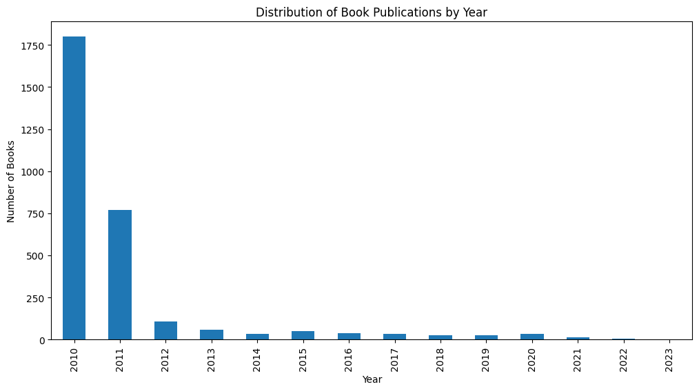

# SUPERVISED & UNSUPERVISED LEARNING
## About Books Dataset

- Let's see null values and fill them

- Then convert categorical data into numerical form for learning a model
- Price format must be changed also

- Data Visualization

The most number of books is in 2010 and it is decreasing

## SUPERVISED LEARNING ALGORITHMS
### LINEAR REGRESSION

### LOGISTIC REGRESSION
- Because of Price is a continuous variable, it couldn't used on logistic regression model

### KNN(k-Nearest Neighbors)

### Decision Trees

### Random Forest Regressor

- Linear regression has a lower MSE value and a lower R² Score compared to the other models, so I choose linear regression model to move on.

## Improvement
- I added more features to improve the model

- In conclusion, the best model is linear regression and I improved it by adding more features. Last MSE is 68.32 and R² Score is 0.04

## UNSUPERVISED LEARNING ALGORITHM
## K-means Clustering

- This is very complicated

## Improvement
- I used log transformation of price and raised number of clusters

## Model Evaluation
- To use unsupervised learning model, silhouette score is the best
- Silhouette Scores for each fold: [0.5164488719469142, 0.5404159662452475, 0.5422671970951595, 0.5373777055169642, 0.545220299684004]
Average Silhouette Score: 0.5363460080976579
- The clusters are well separated